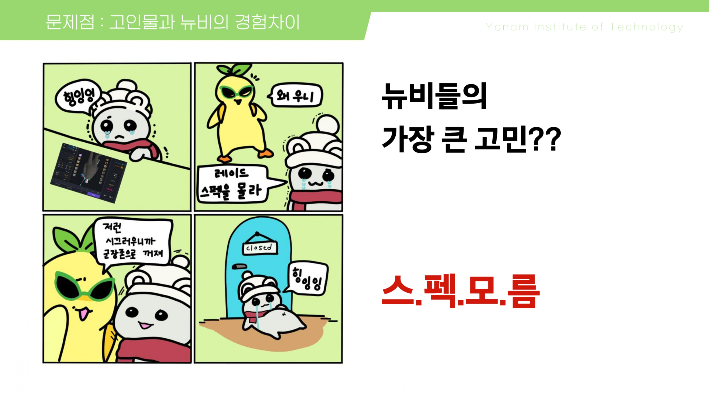

# RPG Inspection - Lost Ark 스펙 검사기

## 📌 프로젝트 소개
Lost Ark 레이드 파티 구성 시 발생하는 스펙 확인의 불편함을 해소하기 위한 웹 기반 스펙 검사 도구입니다.

## 🎯 스펙의 기준

  
  
  
  
  
  

## 📊 스펙 확인 방법

  
  
  

## 👥 고인물과 뉴비의 경험 차이

  
  
  

## 💻 실제 사용 화면

  

## 🔒 보완 사항

  

### 차단 유저 필터링 시스템
- Lost Ark API 연동을 통한 유저 정보 자동 불러오기
- 차단 목록 캡처를 통한 자동 검별 시스템
- 파티 매칭 시 차단된 유저 자동 필터링
- 원정대 단위의 부캐릭터 확인 기능

## 🎮 결론

  

당신도 할 수 있습니다! 편하게 공대장으로써 그들의 군장을 검사하세요!

## 🛠 기술 스택
- **Frontend**: React.js
- **API 연동**: Lost Ark Open API
- **이미지 처리**: OCR API
- **배포**: Docker, AWS

